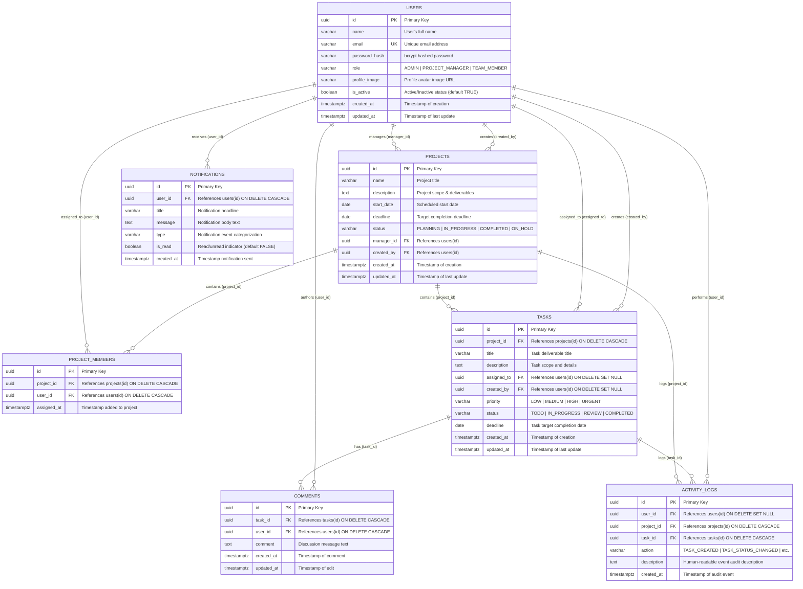

# KnowTheTask — Entity-Relationship (ER) Diagram & Schema Documentation

This document describes the complete PostgreSQL relational database architecture for the **KnowTheTask Project & Team Management Platform**.

---

## 1. Visual Entity-Relationship Diagram (Mermaid)

---

## 2. Detailed Database Table Definitions

### 1. `users`
Stores user authentication profiles, security credentials, verified database roles, and active/inactive membership status.

| Column | Type | Constraints | Description |
|---|---|---|---|
| `id` | `UUID` | `PRIMARY KEY`, `DEFAULT gen_random_uuid()` | Unique identifier for each user |
| `name` | `VARCHAR(255)` | `NOT NULL` | Full name of the user |
| `email` | `VARCHAR(255)` | `UNIQUE`, `NOT NULL` | Login email address (case-insensitive lookup) |
| `password_hash` | `VARCHAR(255)` | `NOT NULL` | Secure bcrypt hash (10 salt rounds) |
| `role` | `VARCHAR(50)` | `NOT NULL`, `CHECK (role IN ('ADMIN', 'PROJECT_MANAGER', 'TEAM_MEMBER'))` | System RBAC permission role |
| `profile_image` | `VARCHAR(500)` | Nullable | Avatar image URL |
| `is_active` | `BOOLEAN` | `DEFAULT TRUE` | Soft-deactivation indicator |
| `created_at` | `TIMESTAMPTZ` | `DEFAULT CURRENT_TIMESTAMP` | Account creation timestamp |
| `updated_at` | `TIMESTAMPTZ` | `DEFAULT CURRENT_TIMESTAMP` | Profile update timestamp |

**Indexes:**
- `idx_users_email` on `users(email)`
- `idx_users_role` on `users(role)`

---

### 2. `projects`
Represents project workspaces with schedules, lifecycle status, manager assignment, and creator tracking.

| Column | Type | Constraints | Description |
|---|---|---|---|
| `id` | `UUID` | `PRIMARY KEY`, `DEFAULT gen_random_uuid()` | Unique identifier for each project |
| `name` | `VARCHAR(255)` | `NOT NULL` | Project title |
| `description` | `TEXT` | Nullable | Comprehensive project scope and deliverables |
| `start_date` | `DATE` | Nullable | Scheduled initiation date |
| `deadline` | `DATE` | Nullable | Scheduled completion deadline |
| `status` | `VARCHAR(50)` | `DEFAULT 'PLANNING'`, `CHECK (status IN ('PLANNING', 'IN_PROGRESS', 'COMPLETED', 'ON_HOLD'))` | Lifecycle status |
| `manager_id` | `UUID` | `REFERENCES users(id) ON DELETE SET NULL` | Project Manager assigned to the project |
| `created_by` | `UUID` | `REFERENCES users(id) ON DELETE SET NULL` | Administrator or creator who initialized project |
| `created_at` | `TIMESTAMPTZ` | `DEFAULT CURRENT_TIMESTAMP` | Record creation timestamp |
| `updated_at` | `TIMESTAMPTZ` | `DEFAULT CURRENT_TIMESTAMP` | Last updated timestamp |

**Indexes:**
- `idx_projects_status` on `projects(status)`
- `idx_projects_created_by` on `projects(created_by)`

---

### 3. `project_members`
Association table facilitating the Many-to-Many relationship between `users` (Team Members) and `projects`.

| Column | Type | Constraints | Description |
|---|---|---|---|
| `id` | `UUID` | `PRIMARY KEY`, `DEFAULT gen_random_uuid()` | Unique identifier for the membership |
| `project_id` | `UUID` | `NOT NULL`, `REFERENCES projects(id) ON DELETE CASCADE` | Associated project workspace |
| `user_id` | `UUID` | `NOT NULL`, `REFERENCES users(id) ON DELETE CASCADE` | Assigned team member |
| `assigned_at` | `TIMESTAMPTZ` | `DEFAULT CURRENT_TIMESTAMP` | Assignment timestamp |

**Unique Constraint:**
- `UNIQUE (project_id, user_id)` (prevents duplicate project memberships)

**Indexes:**
- `idx_project_members_project` on `project_members(project_id)`
- `idx_project_members_user` on `project_members(user_id)`

---

### 4. `tasks`
Work items and deliverables assigned to team members within a project.

| Column | Type | Constraints | Description |
|---|---|---|---|
| `id` | `UUID` | `PRIMARY KEY`, `DEFAULT gen_random_uuid()` | Unique identifier for each task |
| `project_id` | `UUID` | `NOT NULL`, `REFERENCES projects(id) ON DELETE CASCADE` | Parent project |
| `title` | `VARCHAR(255)` | `NOT NULL` | Task headline / summary |
| `description` | `TEXT` | Nullable | Detailed specifications / requirements |
| `assigned_to` | `UUID` | `REFERENCES users(id) ON DELETE SET NULL` | Team member assigned to execute task |
| `created_by` | `UUID` | `REFERENCES users(id) ON DELETE SET NULL` | Manager or Admin creator |
| `priority` | `VARCHAR(50)` | `DEFAULT 'MEDIUM'`, `CHECK (priority IN ('LOW', 'MEDIUM', 'HIGH', 'URGENT'))` | Urgency rating |
| `status` | `VARCHAR(50)` | `DEFAULT 'TODO'`, `CHECK (status IN ('TODO', 'IN_PROGRESS', 'REVIEW', 'COMPLETED'))` | Workflow / Kanban status |
| `deadline` | `DATE` | Nullable | Deliverable due date |
| `created_at` | `TIMESTAMPTZ` | `DEFAULT CURRENT_TIMESTAMP` | Task creation timestamp |
| `updated_at` | `TIMESTAMPTZ` | `DEFAULT CURRENT_TIMESTAMP` | Last status/content update timestamp |

**Indexes:**
- `idx_tasks_project` on `tasks(project_id)`
- `idx_tasks_assigned_to` on `tasks(assigned_to)`
- `idx_tasks_status` on `tasks(status)`
- `idx_tasks_priority` on `tasks(priority)`

---

### 5. `comments`
Chronological discussion threads on individual task deliverables.

| Column | Type | Constraints | Description |
|---|---|---|---|
| `id` | `UUID` | `PRIMARY KEY`, `DEFAULT gen_random_uuid()` | Unique comment identifier |
| `task_id` | `UUID` | `NOT NULL`, `REFERENCES tasks(id) ON DELETE CASCADE` | Associated task |
| `user_id` | `UUID` | `NOT NULL`, `REFERENCES users(id) ON DELETE CASCADE` | Comment author |
| `comment` | `TEXT` | `NOT NULL` | Discussion text |
| `created_at` | `TIMESTAMPTZ` | `DEFAULT CURRENT_TIMESTAMP` | Post timestamp |
| `updated_at` | `TIMESTAMPTZ` | `DEFAULT CURRENT_TIMESTAMP` | Last edit timestamp |

**Indexes:**
- `idx_comments_task` on `comments(task_id)`

---

### 6. `activity_logs`
Immutable audit trail capturing all critical actions and lifecycle events across projects and tasks.

| Column | Type | Constraints | Description |
|---|---|---|---|
| `id` | `UUID` | `PRIMARY KEY`, `DEFAULT gen_random_uuid()` | Audit log identifier |
| `user_id` | `UUID` | `REFERENCES users(id) ON DELETE SET NULL` | Actor who performed the action |
| `project_id` | `UUID` | `REFERENCES projects(id) ON DELETE CASCADE` | Associated project |
| `task_id` | `UUID` | `REFERENCES tasks(id) ON DELETE CASCADE` | Associated task (nullable if project action) |
| `action` | `VARCHAR(100)` | `NOT NULL` | Machine-readable action code |
| `description` | `TEXT` | Nullable | Human-readable audit narrative |
| `created_at` | `TIMESTAMPTZ` | `DEFAULT CURRENT_TIMESTAMP` | Action execution timestamp |

**Indexes:**
- `idx_activity_logs_project` on `activity_logs(project_id)`

---

### 7. `notifications`
Real-time alerts and inbox events delivered to individual users.

| Column | Type | Constraints | Description |
|---|---|---|---|
| `id` | `UUID` | `PRIMARY KEY`, `DEFAULT gen_random_uuid()` | Notification identifier |
| `user_id` | `UUID` | `NOT NULL`, `REFERENCES users(id) ON DELETE CASCADE` | Recipient user |
| `title` | `VARCHAR(255)` | `NOT NULL` | Short notification title |
| `message` | `TEXT` | `NOT NULL` | Notification message body |
| `type` | `VARCHAR(50)` | `NOT NULL` | Categorization (e.g. `TASK_ASSIGNED`, `DEADLINE_APPROACHING`) |
| `is_read` | `BOOLEAN` | `DEFAULT FALSE` | Read / unread indicator |
| `created_at` | `TIMESTAMPTZ` | `DEFAULT CURRENT_TIMESTAMP` | Notification creation timestamp |

**Indexes:**
- `idx_notifications_user` on `notifications(user_id)`

---

## 3. Relational Mapping Summary

1. **`users` to `projects` (1-to-Many as Manager):**
   - Each project has at most one Project Manager (`projects.manager_id -> users.id`).
   - A Project Manager can oversee multiple projects.
2. **`users` to `projects` (Many-to-Many via `project_members`):**
   - A team member can belong to zero, one, or multiple projects.
   - A project can have multiple team members assigned.
3. **`projects` to `tasks` (1-to-Many):**
   - A project contains zero, one, or multiple tasks (`tasks.project_id -> projects.id`).
   - When a project is deleted, all associated tasks are cascade deleted (`ON DELETE CASCADE`).
4. **`users` to `tasks` (1-to-Many as Assignee):**
   - Each task is assigned to at most one team member (`tasks.assigned_to -> users.id`).
   - If an assigned user is deactivated, the historical assignment remains intact.
5. **`tasks` to `comments` (1-to-Many):**
   - Each task can have multiple discussion comments.
   - Deleting a task cascade deletes its comments (`ON DELETE CASCADE`).
6. **`tasks` and `projects` to `activity_logs` (1-to-Many):**
   - All status transitions, assignments, and creation events are recorded chronologically in `activity_logs`.
7. **`users` to `notifications` (1-to-Many):**
   - Users receive targeted alerts for assignments, deadline reminders, and status changes.
